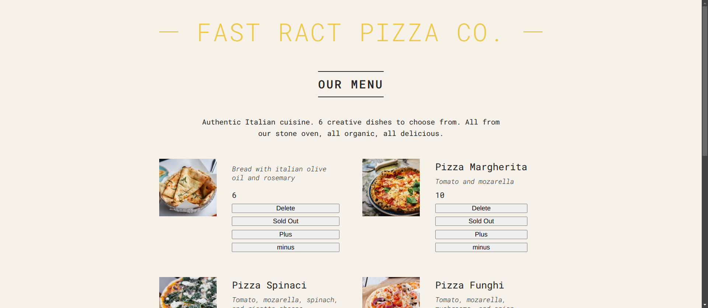
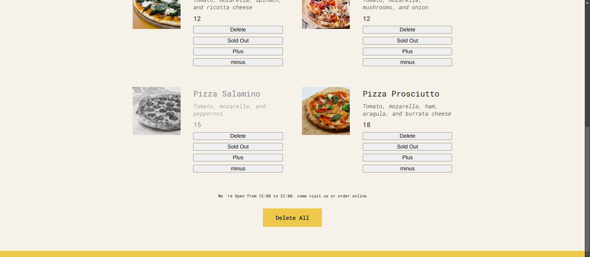

# 🍕 Pizza Menu

## Table of Contents

- [Table of Contents](#table-of-contents)
- [👋Introduction](#introduction)
- [🌟Features](#features)
- [🚀 Live Project](#-live-project)
- [📸 Screenshots](#-screenshots)

- [🛠️Technologies Used](#️technologies-used)
- [🏁Getting Started](#getting-started)
- [⬇️Installation](#️installation)
- [🔧Usage](#usage)
- [📄License](#license)


## 👋Introduction

The Pizza Menu project is a web application that allows users to view and order various types of pizzas. It provides a user-friendly interface to browse the menu, select items, and place orders. The application is built using modern web technologies and aims to deliver a seamless experience for pizza lovers.
## 🌟Features

* View a list of available pizzas with descriptions.
* Increment Pizza order.
* Decrement Pizza order.
* Delete pizza.
* Delete of all pizzas

## 🚀 Live project
[🍕 Pizza Menu](https://pizza-menu-mauve-beta.vercel.app/)

##  📸 Screenshots



## 🛠️Technologies Used

The Pizza Menu project utilizes the following technologies:

-  &nbsp; &nbsp;[Html](https://html.com/)
-  &nbsp; &nbsp;[Css](https://www.w3.org/Style/CSS/Overview.en.html)
-  &nbsp; &nbsp;[React](https://reactjs.org/)
-  &nbsp; &nbsp;[TypeScript](https://www.typescriptlang.org/)


## 🏁Getting Started

To set up the Pizza Menu project locally, follow the instructions below.

## ⬇️Installation


To set up the project locally, follow these steps:

1. Clone the repository:

    ```bash
    git clone https://github.com/Abdelrahman-wahed/pizza-menu.git
    
    ```
2. Navigate to the project directory:

    ```bash
    cd pizza-menu
    
    ```
3. Install the required dependencies:

    ```bash
    npm install
    
    ```


## 🔧Usage

1. Run the development server:

   ```bash
   npm start
   ```


2. Open your browser and go to `http://localhost:3000` to view the application.

## License

This project is licensed under the MIT License - see the [LICENSE](LICENSE.md) file for details.
